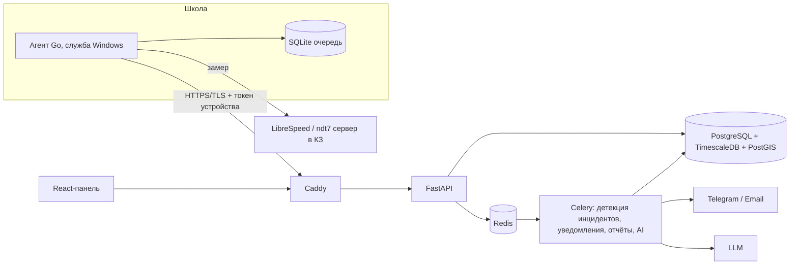

# План реализации: система автономного мониторинга интернета в школах ВКО

Документ покрывает все 20 разделов ТЗ (`docs/product/tz.md`): что взять из действующих
проектов, итоговый стек, архитектуру каждого модуля, схему данных, API, логику статусов и
инцидентов, этапы работ и сценарий демонстрации под критерии приёмки.

Из этого плана выведены ADR (`docs/architecture/decisions/`) и задачи (`docs/tasks/README.md`).
Если план и ADR расходятся — прав ADR: он новее и принят осознанно.

---

## 1. Чему учимся у действующих проектов

### Giga Meter (UNICEF + ITU): ближайший аналог

Открытый проект: клиент `unicef/project-connect-daily-check-app` (AGPL-3.0), сервер
`unicef/giga-meter-backend`. Клиент написан на Ionic/Angular и упакован в Electron. Замер идёт по
протоколу NDT7 через JS-библиотеку M-Lab. Сервер на Node.js (NestJS) с PostgreSQL. Данные уходят
в Giga Maps.

Что берём:

| Логика Giga Meter | Как применяем у себя |
|---|---|
| Регистрация по School ID при первом запуске | Регистрация по одноразовому коду школы, который выдаёт админ (защита от подмены, п. 12) |
| Первый тест в течение 15 минут после включения ПК | То же: «догоняющий» замер после старта службы |
| Слоты в течение дня со случайным временем внутри слота | Слоты с джиттером (п. 2), но расписание приходит с сервера |
| Офлайн-очередь и досылка (события `measurement_queued_offline`, `measurements_synced`) | Локальная SQLite-очередь, идемпотентная досылка по UUID |
| Автообновление клиента | Самообновление агента с проверкой подписи (п. 20) |
| Сбор контекста сети: шлюз, DNS, тип подключения, VPN | Тип Ethernet/Wi‑Fi, шлюз, внешний IP для привязки к линии (п. 10) |
| Замер «лёгкими» тестами, чтобы не забивать канал школы | Ограничение длительности теста (10 с на направление) |

Чего у Giga Meter нет и что делаем сами: Windows-служба без GUI (у них это оконное
Electron-приложение), jitter и packet loss, основная и резервная линии, договорные скорости,
роли «район» и «провайдер», инциденты со статусами, обращения с AI, экспорт в XLSX/PDF, пороги
из админки.

### Другие системы, из которых берём идеи

| Система | Идея |
|---|---|
| M-Lab NDT7 / LibreSpeed | Готовые открытые движки замеров, не изобретаем свой speedtest |
| SmokePing | Серия пингов → медиана, jitter, потери; отсюда метод расчёта jitter/loss |
| Zabbix / Prometheus Alertmanager | Инцидент открывается после N нарушений подряд, закрывается после M нормальных (гистерезис), дедупликация |
| Uptime Kuma | Heartbeat-модель: «нет связи» фиксирует сервер по отсутствию сигналов |
| SamKnows (методика измерений для регуляторов) | Мерить до сервера внутри страны, хранить сырые данные и сервер замера |

---

## 2. Итоговый стек

| Слой | Технология |
|---|---|
| Агент | Go 1.23, служба Windows (`kardianos/service`), также systemd на Linux |
| Установщик Windows | MSI (WiX Toolset v4), подпись кода (Authenticode) |
| Локальное хранилище агента | SQLite (`modernc.org/sqlite`, без CGO) |
| Движок замеров | Свой LibreSpeed-сервер (основной) + ndt7-server (резервный), оба в казахстанском ЦОДе |
| Ping / Jitter / Loss | `prometheus-community/pro-bing` + TCP-пинг как запасной вариант |
| Backend | Python 3.12, FastAPI, SQLAlchemy 2 (async), Alembic, Pydantic v2 |
| Очереди и фоновые задачи | Redis + Celery (+ Celery Beat) |
| БД | PostgreSQL 16 + TimescaleDB + PostGIS |
| Frontend | React 18 + TypeScript + Vite, Refine + Ant Design, TanStack Query |
| Карта | MapLibre GL JS, OSM-подложка, GeoJSON районов ВКО |
| Графики | Apache ECharts |
| Экспорт | openpyxl (XLSX), csv (CSV), WeasyPrint + Jinja2 (PDF), JSON |
| AI | LLM по API (Claude и др.) через адаптер; Ollama + локальная модель как вариант |
| Уведомления | Telegram Bot API, SMTP, уведомления в веб-панели (SSE) |
| Инфраструктура | Docker Compose, Caddy (TLS), GitHub Actions (сборка MSI, образов, тесты) |
| Наблюдаемость | Sentry, Prometheus + Grafana для самого сервера |

---

## 3. Архитектура



Компоненты в Docker Compose: `caddy`, `api`, `worker`, `beat`, `db`, `redis`, `web`, `speedtest`
(LibreSpeed можно вынести на отдельный сервер с гигабитным каналом).

---

## 4. Клиентский агент (п. 2, 10, 12, 20)

### 4.1. Установка на Windows

1. Админ в панели создаёт школу → кнопка «Выдать код установки» → одноразовый код
   (например, `VKO-7F3K-92QD`, действует 7 дней).
2. Школа скачивает `VKO-Agent.msi` из панели.
3. Установка:
   - вручную: мастер спрашивает код, кабинет, тип точки (основная/резервная линия);
   - тихо, в том числе через групповые политики:
     `msiexec /i VKO-Agent.msi /qn ENROLL_CODE=VKO-7F3K-92QD ROOM="Серверная"`
4. MSI устанавливает службу `VKOMonitorAgent`:
   - тип запуска «Автоматически (отложенный запуск)»: стартует при включении ПК, вход
     пользователя не нужен;
   - учётная запись LocalService (минимум прав);
   - восстановление при сбое: перезапуск через 1 мин / 1 мин / 5 мин;
   - правило брандмауэра только на исходящие соединения.
5. При первом старте агент вызывает `POST /api/devices/register` и получает `device_id` и
   `device_token`. Токен хранится зашифрованным через Windows DPAPI (на Linux — файл с правами 600).
6. Удаление через «Программы и компоненты»; админ может заблокировать устройство на сервере.

Иконка в трее не нужна (ТЗ требует отсутствия GUI). Для диагностики есть утилита
`vko-agent.exe status`, которая показывает статус, последний замер и размер очереди.

### 4.2. Когда агент запускается и работает

| Событие | Действие |
|---|---|
| Включение ПК | Служба стартует, через 1–15 мин (случайно) делает догоняющий замер, если текущий слот ещё не выполнен |
| Каждые 5 мин | Heartbeat: `POST /api/devices/heartbeat` (лёгкий запрос, заодно проверка связи) |
| Каждые 15 мин | Забрать конфигурацию `GET /api/agent/config` (ETag, без лишнего трафика) |
| Начало слота расписания | Выбор случайного момента внутри слота (например, 12:00–12:30) |
| Смена сети (подключение кабеля, смена адаптера) | Подписка на уведомления об изменении IP-интерфейсов → проверка связи через 30 с; если интернет появился, досылка очереди |
| Нет интернета | Запись события `no_connection` с временем в очередь; проверки каждые 5 мин фиксируют длительность простоя |
| Выход из сна / гибернации | Как включение ПК |

### 4.3. Алгоритм одного замера

1. Проверка связи: HTTP 204 до своего сервера + DNS. Если связи нет, записываем
   `connection_status = offline` и выходим.
2. Определение контекста: активный адаптер (Ethernet/Wi‑Fi), шлюз, внешний IP (через
   `/api/agent/whoami`).
3. Ping/Jitter/Loss: 30 ICMP-пакетов с интервалом 200 мс до сервера замеров. Ping — медиана RTT;
   jitter — среднее |RTTᵢ − RTTᵢ₋₁| (по RFC 3550); loss — доля потерянных. Если ICMP блокируется,
   используется TCP-connect.
4. Download/Upload: LibreSpeed, по 10 с на направление, несколько потоков. При неудаче — резервный
   ndt7-сервер.
5. Формирование записи с `measurement_uuid`, длительностью теста, сервером, версией агента.
6. Запись в SQLite → отправка → удаление из очереди только после ответа 201/409.

### 4.4. Офлайн-очередь

- Хранятся до 30 дней или до 10 000 записей (старые удаляются первыми).
- Досылка пачками по 100 штук через `POST /api/measurements/batch`.
- Повторы с экспоненциальной задержкой (30 с → 1 ч).
- На сервере стоит уникальный индекс по `measurement_uuid`, поэтому дубли невозможны.

### 4.5. Линии (п. 10)

- Устройство привязывается к точке мониторинга (`monitoring_point`), а та к линии (`line`).
- Если в школе две линии, на каждой своя точка. Дополнительно сервер сверяет внешний IP с
  диапазонами линии: если трафик ушёл через резервную линию, замер помечается `line_id` =
  резервная и в панели появляется предупреждение «основная линия недоступна, работа через резерв».
- Замеры по Wi‑Fi помечаются флагом и по умолчанию исключаются из оценки линии (п. 10: оценивать
  линию, а не Wi‑Fi).

### 4.6. Обновление агента

Админ загружает новую версию в панели и выбирает канал (pilot/stable). Агент видит
`latest_version` в конфигурации, скачивает MSI, проверяет SHA-256 и подпись, запускает `msiexec`
через отдельный updater. Если после обновления нет heartbeat, происходит откат.

### 4.7. Структура кода агента

```text
agent/
  cmd/vko-agent/        main, CLI (install, status, run)
  internal/service/     служба Windows/systemd
  internal/scheduler/   слоты, джиттер, догоняющий замер
  internal/probe/       connectivity, ping/jitter/loss
  internal/speed/       librespeed, ndt7
  internal/netinfo/     адаптер, шлюз, смена сети
  internal/queue/       SQLite
  internal/api/         клиент, токен, повторы
  internal/secure/      DPAPI
  internal/update/      самообновление
installer/wix/          MSI
```

---

## 5. Схема базы данных

Справочники: `regions` (районы/города, геометрия PostGIS), `providers`, `connection_types`.

Организации и линии (п. 14, 15):

| Таблица | Ключевые поля |
|---|---|
| `schools` | id, school_code (School ID), full_name, region_id, address, geom (точка), is_active |
| `lines` | id, school_id, provider_id, connection_type_id, line_identifier, contract_down_mbps, contract_up_mbps, contract_number, contract_date, started_at, status (main/reserve/disabled), ip_ranges |
| `school_contacts` | id, school_id, full_name, position, phone, email, provider_support_contact, updated_at |
| `monitoring_points` | id, school_id, line_id, name, room, is_primary |

Устройства и замеры (п. 2, 7):

| Таблица | Ключевые поля |
|---|---|
| `devices` | id, device_uid, monitoring_point_id, hostname, os, agent_version, token_hash (argon2), registered_at, last_seen_at, status (active/blocked) |
| `enrollment_codes` | code_hash, school_id, expires_at, used_at |
| `measurements` (hypertable) | id, measurement_uuid (unique), device_id, line_id, measured_at, received_at, download_mbps, upload_mbps, ping_ms, jitter_ms, packet_loss_pct, connection_status, duration_s, external_ip, server, iface_type, agent_version, thresholds_snapshot (jsonb), quality_status, contract_ok |
| `heartbeats` (hypertable) | device_id, ts, online |
| `outages` | id, device_id, line_id, started_at, ended_at (фиксируются агентом и сервером) |

Continuous aggregates: `m_hourly`, `m_daily` по линии и устройству (avg/min/max, число замеров,
число проблемных). На них строятся аналитика, рейтинг школ и тепловая карта по часам.

Настройки и контроль (п. 11, 18, 20): `threshold_profiles` (глобальный, районный, для отдельной
линии), `schedules`, `incident_rules`, `agent_releases`, `settings`.

Инциденты и обращения (п. 17, 19): `incidents`, `incident_events` (история статусов и
комментарии), `appeals`, `appeal_events`.

Пользователи и аудит (п. 12, 16): `users`, `roles`, `user_scopes` (region_id / provider_id /
school_id), `audit_log`, `notifications`, `notification_log`.

---

## 6. Логика статусов (п. 11, 13)

Статус замера (считается на сервере, пороги берутся из профиля и сохраняются в
`thresholds_snapshot`):

| Статус | Условие (базовые пороги из ТЗ) |
|---|---|
| Норма | Down ≥ 20 и Up ≥ 20 Мбит/с, Ping ≤ 100, Jitter ≤ 30, Loss ≤ 2% |
| Нестабильно | Нарушен один показатель, отклонение не более 30% от порога |
| Критично | Нарушено несколько показателей или отклонение больше 30% |
| Нет соединения | `connection_status = offline` |

Проценты «Нестабильно/Критично» настраиваются в админке.

Статус школы на карте — по последним N замерам основной линии (N = 3 по умолчанию) плюс
heartbeat. Если нет heartbeat дольше 15 мин в рабочее время, статус «Нет соединения» (серый —
«нет данных», если ПК выключен вне рабочего времени).

Доступность (≥ 99%) = 1 − (время простоя / время наблюдения) за период. Простой берётся из
`outages` и пропусков heartbeat в рабочие часы школы, которые настраиваются.

Договор: отдельный флаг `contract_ok` сравнивает факт с договорной скоростью. Устойчивое
несоответствие — более X% замеров за 7 дней ниже договора (п. 14).

---

## 7. Инциденты и уведомления (п. 18, 19)

Правило в `incident_rules`: метрика, условие, N подряд нарушений или длительность ≥ T минут,
гистерезис на закрытие (M подряд нормальных).

Celery-задача после каждого замера и раз в 5 мин по heartbeat:

1. Проверяет правило для линии.
2. Если условие достигнуто и открытого инцидента нет, создаёт инцидент `INC-2026-000123` со
   статусом «Новый», метриками-основаниями, началом = время первого нарушения.
3. Если инцидент открыт, обновляет «последнее нарушение» (дедупликация, без спама).
4. Если метрики вернулись в норму M раз подряд, заполняет `restored_at` и предлагает статус
   «Устранён» (закрывает пользователь или автоматически через X часов).
5. Отправляет уведомления получателям по области видимости: панель (SSE), Telegram, email. Каждая
   отправка пишется в `notification_log`.

Статусы: Новый → Передан поставщику → В работе → Ожидает информации → Устранён → Закрыт. Все
переходы попадают в `incident_events`.

Длительность считается как `restored_at − started_at`, время реакции провайдера — как
`restored_at − sent_to_provider_at`.

Аналитика: количество, суммарная и средняя длительность, повторяемость (инциденты на линию за
30 дней) по школам, районам и провайдерам.

---

## 8. Обращения и AI (п. 17)

1. Кнопка «Создать обращение» в карточке инцидента или школы.
2. Сервер собирает контекст: School ID, школа, провайдер, договор, период, агрегаты метрик,
   пороги, число и длительность простоев, выдержку замеров.
3. Промпт с шаблоном официального письма (реквизиты, ссылка на договор, требование устранить,
   срок ответа) → LLM → черновик.
4. Пользователь редактирует текст в редакторе, добавляет комментарий → «Отправить».
5. Присваивается номер `ОБР-2026-000045`, письмо уходит на email провайдера, сохраняется PDF,
   провайдер видит обращение в своём кабинете и меняет статус.

Персональные данные в LLM не передаются (ФИО и телефоны подставляются после генерации).

Адаптер `LLMProvider` позволяет переключаться между облачной и локальной моделью через настройки.

---

## 9. Роли и доступ (п. 16)

| Роль | Область видимости | Возможности |
|---|---|---|
| Школа | своя школа | просмотр, создание обращений |
| Район/город | школы района | аналитика, инциденты, обращения |
| Область | вся ВКО | всё, кроме технического администрирования |
| Провайдер | свои линии | просмотр своих линий, смена статуса инцидентов и обращений |
| Администратор | всё | пользователи, устройства, справочники, настройки, журналы |

Реализация в два слоя: проверка прав в FastAPI (dependency `require(permission)`) и Row-Level
Security в PostgreSQL по `app.user_scope`. Блокировка пользователя через `is_active = false`,
история сохраняется. Все изменяющие действия и входы пишутся в `audit_log` через middleware.

---

## 10. API (п. 6)

Агент (авторизация `Authorization: Device <token>`):

| Метод | Назначение |
|---|---|
| `POST /api/devices/register` | регистрация по коду |
| `POST /api/devices/heartbeat` | сигнал «жив» |
| `GET /api/agent/config` | расписание, пороги, сервер замеров, версия |
| `GET /api/agent/whoami` | внешний IP |
| `POST /api/measurements` | один замер |
| `POST /api/measurements/batch` | досылка очереди |
| `POST /api/outages` | простой, зафиксированный агентом |
| `GET /api/agent/releases/latest` | обновление |

Панель (JWT + права):

| Группа | Методы |
|---|---|
| Авторизация | `/api/auth/login`, `/refresh`, `/logout`, `/me` |
| Сводка и карта | `GET /api/dashboard/summary`, `/api/map/schools` (GeoJSON с фильтрами) |
| Школы | `GET/POST/PATCH /api/schools`, `/api/schools/{id}`, `/api/schools/{id}/devices`, `/lines`, `/contacts`, `/incidents` |
| Устройства | `GET /api/devices/{id}`, `/api/devices/{id}/measurements`, `POST /block`, `/unblock`, `/enrollment-codes` |
| Аналитика | `GET /api/analytics?level=school\|district\|provider\|region&period=…` |
| Инциденты | CRUD `/api/incidents`, `POST /api/incidents/{id}/status`, `/comments` |
| Обращения | `POST /api/appeals/draft` (AI), `POST /api/appeals`, `PATCH`, `GET /api/appeals/{id}/pdf` |
| Экспорт | `POST /api/exports` (фильтры + формат) → `GET /api/exports/{id}` |
| Админка | `/api/admin/users`, `/roles`, `/providers`, `/regions`, `/thresholds`, `/schedules`, `/incident-rules`, `/agent-releases`, `/audit-log` |

Документация генерируется автоматически в Swagger (`/api/docs`) и прикладывается к поставке.

---

## 11. Веб-панель (п. 4, 5, 13)

| Экран | Содержимое |
|---|---|
| Главная | KPI (школы, ПК, активные, замеры за 24 ч, средние Down/Up/Ping, проблемные), карта ВКО с цветными маркерами и кластерами, фильтры (район, провайдер, тип подключения, статус, период), всплывающая таблица по школе |
| Список школ | таблица с сортировкой: средние показатели, последний замер, статус |
| Карточка школы | текущие показатели, графики за период, тепловая карта «час × день», линии и договор, сравнение с договором, контакты, ПК, инциденты, обращения, кнопка отчёта |
| Карточка ПК | Device ID, имя, кабинет, последняя связь, версия агента, история замеров |
| Аналитика | день/неделя/месяц/свой период; avg/min/max/количество; рейтинг и сравнение школ; разрезы по району и провайдеру; часы ухудшения |
| Инциденты | список, канбан по статусам, карточка с историей |
| Обращения | список, редактор с AI-черновиком |
| Экспорт | конструктор выгрузки |
| Админка | все справочники, устройства, коды установки, релизы агента, пороги, расписания, правила, журналы |
| Кабинет провайдера | только свои линии, инциденты и обращения |

---

## 12. Экспорт (п. 9)

- Фильтры: школа, ПК (несколько), период, статус соединения, набор колонок.
- Сырые данные (XLSX, CSV, JSON): школа, ПК, кабинет, дата, время, Down, Up, Ping, Jitter, Loss,
  статус.
- Агрегаты по школе: количество замеров, средний и минимальный Down, средний Up, средний Ping,
  число и доля проблемных.
- PDF-отчёт по школе: шапка, KPI, графики, число и длительность простоев, таблица замеров.
- Большие выгрузки формируются в фоне через Celery, файл выдаётся по ссылке.

---

## 13. Безопасность (п. 12)

- TLS 1.2+ везде (Caddy), HSTS; возможен WireGuard-канал для агентов, если заказчик потребует VPN.
- Токен устройства хранится хэшем (argon2) на сервере и через DPAPI на клиенте; ротация по кнопке.
- School ID никогда не берётся из запроса агента, а выводится из привязки устройства → защита от
  подмены.
- Пароли: argon2; секреты — в переменных окружения/Docker secrets.
- Rate limit на API агентов, валидация диапазонов метрик (отсечение явного мусора).
- Журналы: входы, административные действия, ошибки передачи, отправка уведомлений.
- Персональные данные: собираются только контакты ответственных; учеников и учителей система не
  касается.
- Резервное копирование БД ежедневно (pgBackRest).

---

## 14. Этапы работ

Ориентир для команды из 4 человек (агент, backend, frontend, fullstack/DevOps) на 6 недель.
Если срок другой, этапы масштабируются пропорционально.

| Этап | Недели | Результат |
|---|---|---|
| 0. Подготовка | 0.5 | репозиторий, Docker Compose, CI, схема БД, контракт API в OpenAPI, GeoJSON ВКО, тестовые данные школ |
| 1. Ядро данных | 1–1.5 | агент: служба, расписание, замеры, очередь; backend: регистрация, приём замеров, heartbeat, config; LibreSpeed-сервер |
| 2. Панель MVP | 2–3 | авторизация, роли, карта, сводка, школы, ПК, история, базовая аналитика |
| 3. Экспорт и админка | 3–4 | XLSX/CSV/PDF, справочники, линии, договоры, контакты, пороги, расписания, коды установки |
| 4. Инциденты и уведомления | 4–5 | правила, детекция, статусы, Telegram/email, кабинет провайдера |
| 5. AI и обращения | 5 | черновики, редактор, отправка, история |
| 6. Доводка | 5–6 | MSI с подписью, автообновление, RLS, аудит, нагрузочный тест (симулятор 1000 агентов), документация, демо |

Распределение ролей:

- Агент (Go): служба, замеры, очередь, MSI, обновление.
- Backend (Python): API, БД, статусы, инциденты, AI, экспорт.
- Frontend (React): карта, дашборды, карточки, админка.
- Fullstack/DevOps: инфраструктура, CI, RLS и безопасность, симулятор агентов, тестирование,
  документация.

---

## 15. Поставка и демонстрация

Состав поставки: `VKO-Agent.msi` + Linux-пакет; `docker-compose.yml` с `.env.example`; инструкция
администратора; инструкция установки агента; описание архитектуры; описание API (Swagger + PDF);
тестовые данные.

Сценарий демонстрации под критерии приёмки:

1. Установка MSI на чистый Windows → перезагрузка → агент сам зарегистрировался, первый замер
   виден на карте.
2. Отключить кабель → «Нет соединения» на карте → инцидент и сообщение в Telegram → подключить
   кабель → очередь досылается, инцидент получает время восстановления.
3. Ограничить скорость (например, через NetLimiter) → «Нестабильно/Критично» → AI-обращение
   провайдеру → провайдер в своём кабинете меняет статус.
4. Сменить порог в админке → агент подхватывает конфигурацию без переустановки.
5. Войти под ролями района и провайдера → видны только свои данные.
6. Экспорт XLSX/CSV и PDF-отчёт по школе.
7. Симулятор: 350 школ, 1000 ПК, 3 месяца истории → карта и аналитика работают быстро.

---

## 16. Риски

| Риск | Решение |
|---|---|
| Школьный ПК выключают, данные неполные | Догоняющий замер при включении; рекомендовать выделенный ПК или мини-ПК в серверной; «нет данных» отличать от «нет связи» |
| Антивирус блокирует агент | Подписанный MSI, минимальные права, отсутствие инъекций |
| Замер нагружает канал во время уроков | Короткие тесты, слоты вне пиковых уроков настраиваются |
| Сервер замеров сам становится узким местом | Отдельный сервер с гигабитным каналом, ndt7 как резерв, запись сервера в каждом замере |
| Провайдер оспаривает данные | Сырые данные, снимок порогов, сервер замера, тип подключения и Ethernet-флаг в каждой записи |
| Лицензия Giga Meter AGPL-3.0 | Код не копируем, только идеи и методика |
